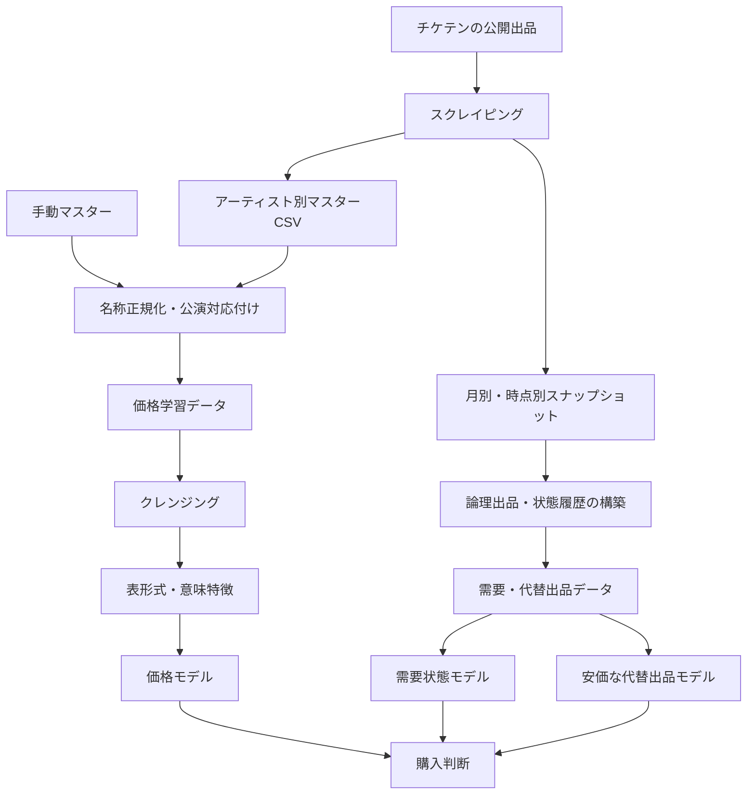

# 第6章　研究内容

## 6.1　開発したシステムの全体構成

本研究で開発したシステムは、データ収集、マスタ更新、スナップショット保存、論理出品の統合、データクレンジング、意味特徴抽出、価格モデル学習、需要状態モデル学習、代替出品モデル学習および購入判断の生成から構成される。処理を一つの巨大なプログラムへまとめず、役割ごとにファイルと成果物を分離した。これにより、一部の処理が失敗した場合でも、完了済みの高コストなBERT抽出やQwen処理を再利用できる。

価格モデルは売却済みチケットから妥当価格を学習する。需要状態モデルは、各観測時点から一定期間内の掲載継続、売却確認または削除を予測する。代替出品モデルは、同一公演かつ比較可能な条件で、現在より安い新規出品が現れるかを予測する。購入判断では、現在価格と妥当価格の差、現在出品の売却確率、安価な代替の出現確率を統合する。

## 6.2　スクレイピングと保存形式

スクレイパーは対象グループごとにチケテンの出品情報を取得し、最新状態をアーティスト別マスターCSVへ保存する。同時に、収集時点の市場状態を失わないよう、月別スナップショットと市場スナップショットを保存する。マスターは各出品の最新状態を把握する用途、スナップショットは時系列の状態変化を再構成する用途に使用する。

各行には、出品を識別するID、公演情報、価格、枚数、説明文、状態、最初に観測した時刻、最後に観測した時刻、売却を検知した時刻等を保持する。取得途中で通信が失敗した場合に不完全な結果で既存データを上書きしないよう、取得件数や状態分布を検査してから保存する。保存前に一時ファイルを作成し、正常に書き終えた場合だけ正式ファイルへ置き換えることで、途中終了による破損を抑える。

## 6.3　論理出品と状態履歴

ウェブ上のURLや共有コードが変化しても、実質的に同じ出品である場合がある。このため、物理的な取得行と、分析上の一件のチケットを表す論理出品を区別する。出品IDを第一の識別子とし、公演、価格、説明文、枚数、観測時刻等を補助情報として統合する。

同一論理出品のスナップショットを時刻順に並べ、最初の観測、最後の掲載確認、売却確認、削除確認を記録する。初回取得時点ですでに売却済みだった行は、価格回帰には使用できるが、掲載から売却までの正確な時間が分からない。そのため、需要状態モデルの時間教師からは隔離する。一方、掲載中から売却済みへの変化を直接観測できた行は、一定期間内の売却教師として使用する。

## 6.4　データ品質監査

学習前に、入力ファイル数、raw行数、論理出品数、状態別件数、ID欠損、無効な状態、時刻矛盾、重複および削除件数の急増を検査する。2026年9月4日時点の監査では、13個のマスターファイルからraw 7,764行、論理出品7,296件を確認し、掲載中2,684件、売却済み2,960件、削除1,652件であった。ID回転の残存、状態矛盾重複、ID・状態・時刻の無効値は確認されず、品質ゲートを通過した。

過去には、実体が2026年7月28日で止まったデータにおいて、同時刻に3,801件が一括して削除扱いになる異常が確認された。このようなスナップショットを需要学習へ使用すると、通常の需要ではなくスクレイピング失敗をモデルが学習する。そのため、削除急増、観測期間および最新掲載件数を品質ゲートで検査し、異常期間を正式な学習・推論から除外した。

## 6.5　価格学習データの作成

売却済みの論理出品を抽出し、説明文、価格範囲、公演内分位点および重複IDの規則を適用する。2026年9月4日時点では、Model13相当のクレンジング後に9,353件のsoldデータが価格学習候補となった。この件数はウェブマスターの単一時点のsold数より多い。これは、価格学習用ローダーが保存済みの複数データおよび過去の売却記録を統合しているためである。論文最終版では、対象データディレクトリと重複除去後の件数を固定し、同じ処理を再実行して表へ記載する。

価格は二千円以上十五万円以下へ限定した後、公演別に下位5%と上位2%を除外する。対象価格を`log1p`で変換し、円単位MAEをモデル選択指標とする。定価が得られる場合には価格差、価格比および定価倍率を特徴量候補とする。ただし、対象行の価格そのものから作った特徴量を入力へ戻さない。

## 6.6　表形式特徴量

表形式特徴量は、出品、公演、アーティスト、会場、時期、説明文から抽出した条件および過去市場の情報から作成する。主な特徴量群は以下のとおりである。

|特徴量群|主な項目|意図|
|---|---|---|
|出品条件|枚数、券種、名義種別、受渡方法、出品者評価|商品・取引条件の違い|
|公演条件|公演日、曜日、月、開演時刻、初日、最終公演|日程による需要差|
|会場条件|会場、地域、収容人数|供給規模と移動条件|
|人気・供給|FC会員数、ツアー公演数、定価|需要規模と供給機会|
|時間|初回観測から公演までの日数|期限接近による変化|
|市場相場|過去の中央値、件数、価格分位|観測時点以前の市場水準|
|説明文条件|番手、名義数、ランダム、同行、視界条件|自由記述にだけ存在する条件|

曜日、月、開演時刻等は連続値だけでなくカテゴリとしても表現し、必要に応じてsin・cosによる周期特徴を追加する。例えば曜日を0から6の連続値だけで表すと日曜日と月曜日が遠い値になるが、周期表現を加えることで一周期の隣接関係を示せる。

カテゴリ変数はLightGBM用には希少カテゴリをまとめたone-hot encodingを使用し、CatBoostでは文字列カテゴリとして渡す。受渡方法は自由記述に近く種類が多いため、表記を正規化してから低頻度カテゴリをまとめる。欠損値補完、one-hotの語彙および定数列除外は学習foldだけから決める。

## 6.7　説明文のルールベース解析

説明文から、チケット市場に固有の条件を正規表現および辞書によって抽出する。例として、番手、総名義数、すり替えの有無、ランダム配布、同行・単番・連番、当選経路、ゲート、制作開放席、注釈付き席、見切れ席、バラ売り、急募および定価以下等がある。

単語の存在だけで真偽を決めると、「ランダムではありません」をランダム配布として扱う危険がある。そのため、否定表現、数値との距離、同義語および表記揺れを考慮する。抽出できない値は無理に補わず、不明カテゴリまたは欠損とする。説明文全文を論文へ掲載せず、匿名化した短い例と抽出結果の組を示す。

## 6.8　BERT特徴量の作成

初期のハイブリッドモデルでは、日本語BERT`cl-tohoku/bert-base-japanese-v3`へ説明文とタグを入力した。入力をトークン化し、最大128トークンへ切り詰めまたはパディングする。最終層の`[CLS]`に対応する768次元ベクトルを一件の文章特徴として保存した。

BERT抽出は価格ラベルを使用しないが、保存済みベクトルを異なる行へ結合すると重大な誤りになる。このため、ticket ID、入力文章のハッシュ、モデル名および抽出版を成果物へ記録する。新しい出品または説明文が更新された行だけをGPUで再抽出し、一致する既存行は再利用する。

Model15ではBERTをLightGBMへ直接入力する構成、BERTだけを追加する構成等を比較した。Model16では、768次元をPCAで16、32、48、64、96次元のいずれかへ圧縮し、Ridge回帰へ入力する独立expertとした。PCA次元とRidgeの正則化は外側評価foldを使用せず、内側foldで選択した。

## 6.9　Qwen価格回帰の開発

初期ハイブリッドモデルでは、`Qwen/Qwen2.5-7B-Instruct`を回帰モデルとして追加学習した。各チケットについて、アーティスト、会場と収容人数、定価、券種、タグ、枚数、名義種別、公演日までの日数、ツアー初日・最終公演、総公演数、FC会員数、座席条件および説明文を文章形式のプロンプトへまとめた。出力層を一つの回帰値とし、正解には対数価格を使用した。

GPUメモリを抑えるため、4ビットNF4量子化とLoRAを使用した。初期モデルではLoRAのランク8、alpha 16、dropout 0.05とし、Attentionの`q_proj`と`v_proj`を主な更新対象とした。最大入力長256、物理バッチサイズ2、学習率`2×10^-4`、最大3エポックを基本設定とした。その後のModel15ではクレンジング済みデータを五foldへ分け、各foldの学習側だけでQwenを最大5エポック追加学習し、検証側の価格を推論してOOF特徴量を作成した。

Qwenが出力した対数価格は最終価格として直接採用せず、LightGBMへ入力する一つの特徴量とした。しかし、長さ別samplerが評価時にも行順を並べ替え、予測配列を元の行へそのまま代入した不具合が発見された。保存済みadapter自体の検証lossは正常であったため、評価・推論samplerを`SequentialSampler`へ固定し、元の行順で再推論した。修復後のordered Qwen単体MAEは8,612円であったが、後段モデルへ追加すると最適化後もMAEが261円悪化した。この結果から、Qwen価格予測を必須入力とする方針を撤回した。

## 6.10　Qwenによる価格非依存の意味抽出

Qwenの文章理解能力を価格の直接回帰とは別の形で利用するため、説明文から構造化JSONを生成する処理を作成した。抽出項目には、座席階層、列位置、FC先行、ランダム配布、名義、本人確認、当選経路、配布方法、視界条件等を含む。プロンプトには正解価格または価格推定を含めず、`price_estimate`の生成を明示的に禁止した。

生成されたJSONはschemaに従って型と値域を検査し、解析不能な出力は失敗ログへ保存する。途中終了に備えて一定件数ごとにatomic保存し、再実行時は未処理説明文だけを抽出する。同一説明文については結果を再利用する。意味特徴が全説明文を覆っていない状態で学習すると、欠損の有無が収集時期を表してしまうため、学習前に充足率を検査する。

## 6.11　Model8型ハイブリッドモデル

当初のモデルは、表形式特徴量、BERTの768次元ベクトルおよびQwenの一つの価格予測値を横方向に結合し、LightGBMへ入力する特徴量融合型モデルであった。

$$
X_{hybrid}=[X_{table}, Z_{BERT}, \hat{y}_{Qwen}]
$$

$$
\hat{y}=\mathrm{expm1}(\mathrm{LightGBM}(X_{hybrid}))
$$

LightGBMのハイパーパラメータはOptunaで50試行探索し、四fold交差検証の対数RMSEを小さくする設定を選択した。最終評価では五fold OOF予測を作り、円へ逆変換して誤差を計算した。この構成により、表形式の市場情報と文章の意味を同時利用できると考えたが、初期版にはQwen特徴量の完全なOOF化やfold内前処理が不十分な部分があり、世代を重ねて評価方法を修正した。

## 6.12　Model15における比較実験

Model15では、表形式と価格非依存JSON意味特徴を共通部分とし、BERTとQwen価格予測の組合せを次の四種類に分けた。

1. `full`：BERTとQwenを両方使用する。
2. `qwen_only`：Qwenだけを追加する。
3. `bert_only`：BERTだけを追加する。
4. `tabular_only`：BERTとQwen価格予測を使用しない。

さらに、対数価格にL1を用いる`log_l1`、高価格へ重みを付ける`log_weighted`、生価格にHuber損失を用いる`raw_huber`を組み合わせ、計12候補を比較した。Optuna 120試行で特徴構成と学習方式を共同探索し、同一の重複グループ五fold OOFにおける円MAEを基準に最良候補を選んだ。最良構成は`log_l1__tabular_only`となった。この結果は、BERTとQwenが一般に無用であることではなく、現在のデータ、特徴化方法、モデル容量および評価条件では追加改善が確認できなかったことを意味する。

## 6.13　Model16の構成

Model16では、全価格帯へ共通する固定予測式を用い、次の四つのexpertをnested cross-validationで比較した。

- `lgbm_log_mae`：one-hot表特徴とJSON意味特徴から対数価格を学習するLightGBM。
- `lgbm_raw_mape`：実価格の逆数を重みとし、相対誤差を重視するLightGBM。
- `catboost_raw_mae`：カテゴリを直接扱い、生価格のMAEを学習するCatBoost。
- `bert_ridge`：PCAで圧縮したBERT特徴を使用するRidge回帰。

最終予測は各expertの予測を非負かつ総和一の固定重みで加重平均する。内側foldで重みを決定し、外側foldのすべての行へ同じ式を適用する。価格帯別に別モデルを選ぶ処理や、行ごとのルーティングは使用しない。統合時には、最良MAE expertに対してMAPEが0.10ポイントを超えて悪化しない制約を設けた。

外側五foldは完全な未使用評価行、内側四foldは各expertのOptuna、BERT次元および統合重みの決定に使用した。同一または重複する説明文は同じfoldへ置いた。全9,353件に対し、外側foldごとに内側学習を行うため、通常の五foldより多くのモデルを学習した。成果物には各foldの予測、選択設定、評価値および最終モデルを保存した。

## 6.14　需要状態モデル

需要状態モデルでは、各論理出品の観測時点を基準に、一日、三日、七日以内の状態を掲載継続、売却確認、削除の三クラスとして作成する。初回から売却済みの行や、必要な期間を最後まで観測できない行は、時間教師として使用しない。欠測期間や異常な一括削除が含まれるスナップショットも除外する。

入力には現在価格、妥当価格との差、定価倍率、公演日までの日数、会場、アーティスト、枚数、説明文条件、同一公演内の掲載数、価格順位および直近の状態変化等を使用する。出力は三状態の確率であり、確率の総和が一になるようにする。モデル選択ではlog lossを中心とし、Brier score、macro F1および確率校正も確認する。

## 6.15　安価な代替出品モデル

代替出品モデルでは、現在の出品と比較可能な新規出品を定義する。最低限、同一公演であることを条件とし、枚数、券種、名義種別、受渡条件等を必要に応じて一致または許容範囲内とする。現在価格より設定額または設定割合以上安い出品が、一日、三日、七日以内に初めて観測された場合を正例とする。

市場全体の最安値だけを目的変数にすると、購入者が利用できない枚数や券種の出品まで代替候補になる。そのため、比較可能性の定義を先に固定する。入力には現在の価格順位、同一公演の出品数、過去の新規出品頻度、公演日までの日数、曜日、会場およびアーティスト等を用いる。評価ではPR-AUC、log loss、Brier scoreおよび確率校正を確認する。

## 6.16　購入時期判断モデル

購入時期判断では、価格モデルが出力する妥当価格、需要状態モデルの短期売却確率、代替出品モデルの安価な新規出品確率を入力する。現在価格が妥当価格以下で、短期売却確率が高く、安価な代替の出現確率が低い場合は購入寄りとする。一方、現在価格が妥当価格を大きく上回り、売却確率が低く、代替出品確率が高い場合は待機寄りとする。

判断閾値は人によって異なるため、買い逃し回避、均衡、節約重視の複数方針を用意する。学習用履歴で閾値を調整した後、別期間で支払額、買い逃し率、判断回数および機会損失を比較する。AIは購入を強制せず、価格と各確率、その根拠となる主要特徴を並べて提示する。

## 6.17　開発したAIの出力

価格モデルの直接出力は円単位の予測成立価格である。内部で対数価格を予測したモデルは指数変換して円へ戻し、負の予測は許容範囲へ制限する。単一の数値だけを表示すると確実な価格と誤解されるため、可能であれば予測価格、現在価格との差、定価倍率、過去相場および検証誤差を合わせて表示する。

需要状態モデルは、一日、三日、七日以内の掲載継続、売却確認、削除の確率を出力する。代替出品モデルは同期間内に安価な比較可能出品が現れる確率を出力する。購入判断は「購入寄り」「待機寄り」等の分類だけでなく、その判断に用いた妥当価格との差、売却確率、代替出品確率および選択した方針を示す。

出力例は以下の形式を想定する。

|項目|出力例|意味|
|---|---:|---|
|現在価格|30,000円|入力時点の表示価格|
|予測成立価格|27,500円|類似条件から推定した参考価格|
|価格差|+2,500円|現在価格－予測成立価格|
|3日以内売却確率|0.62|売却状態を確認する予測確率|
|3日以内安価代替確率|0.28|比較可能な安価出品の出現確率|
|判断|購入寄り|指定方針による参考判断|

この数値は説明用の仮例であり、研究結果ではない。論文へ掲載する実例には、保存済みモデルが実際に出力した匿名化データを使用する。

## 6.18　成果物と再実行

価格モデルでは、評価JSON、OOF予測CSV、候補比較CSV、学習済みモデルおよびOptunaデータベースを保存する。意味特徴は説明文をキーとしたJSON、BERTは行IDとハッシュに対応する配列として保存する。需要、代替、購入判断モデルもそれぞれのフォルダ内に設定、前処理、学習、推論、評価および成果物を分離する。

一括実行では、データ監査、未生成意味特徴、価格モデル、需要状態、代替出品、購入判断の順に処理する。高コスト処理は完了状態を記録し、入力またはコードのfingerprintが変化していなければ再利用する。ただし、旧データ用のfold、行順が保証されないQwen予測および入力件数と一致しないBERT配列は拒否する。

## 6.19　本章のまとめ

本章では、スクレイピングから購入判断までの実装内容を示した。初期にはLightGBM、BERT、Qwenを特徴量レベルで統合するハイブリッドモデルを構築したが、OOF化と行順を修正した比較では、複雑な文章モデルの追加が必ずしも精度向上につながらなかった。そこで、価格非依存のJSON意味特徴を維持しつつ、LightGBMとCatBoostを中心とする全価格共通アンサンブルへ改良した。また、価格とは別に状態変化と代替出品を予測し、購入判断へ接続する処理を構築した。次章では、保存済み成果物から確認できる価格モデルの結果と、今後確定すべき需要・購入判断の評価項目を示す。
